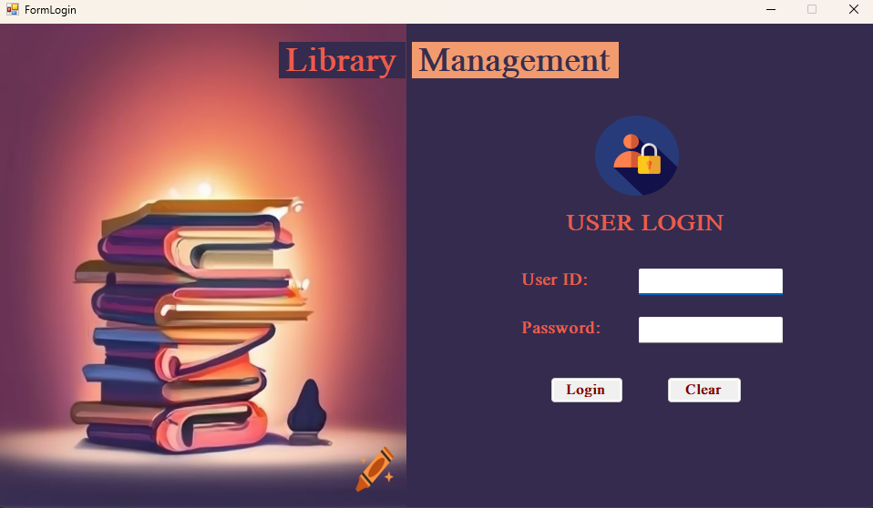
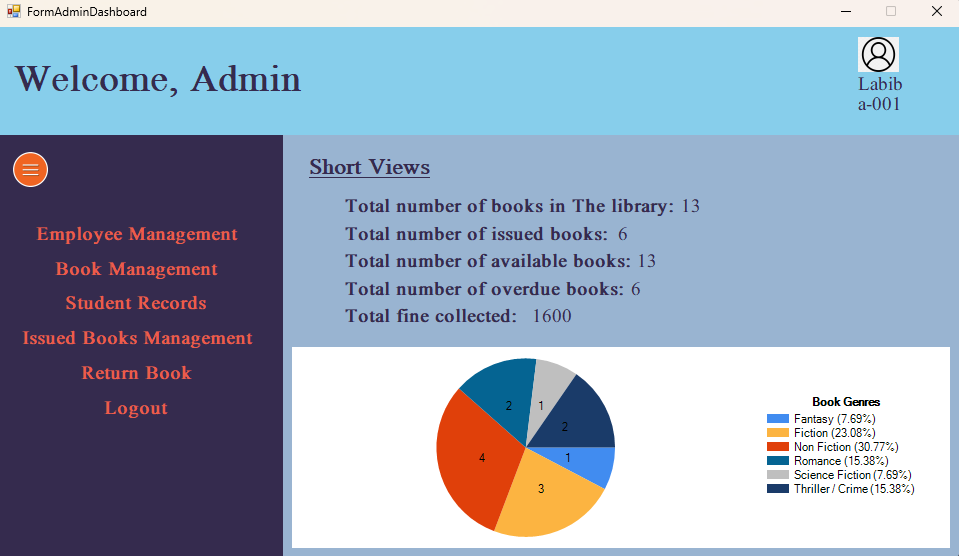
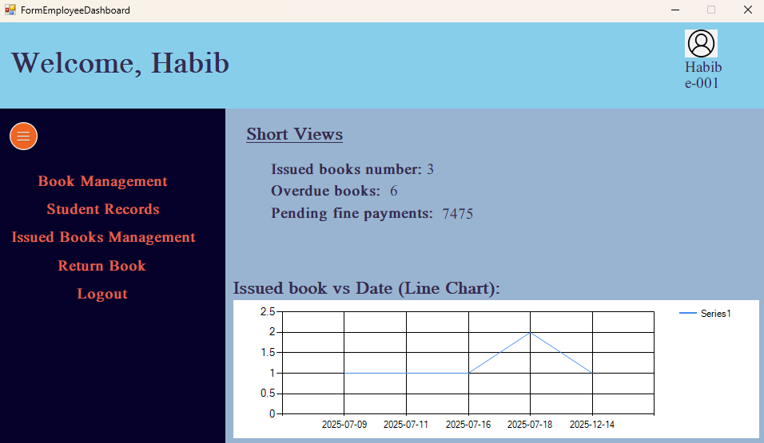
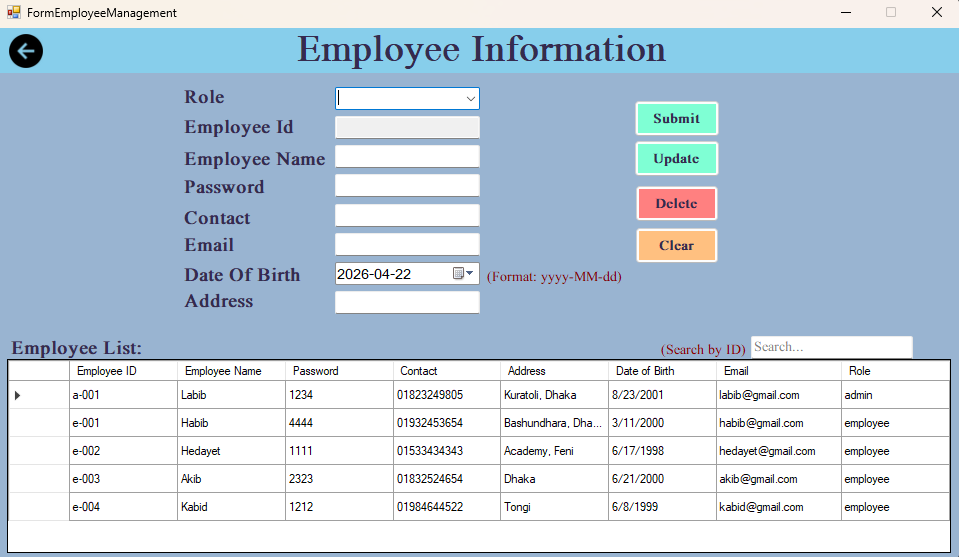
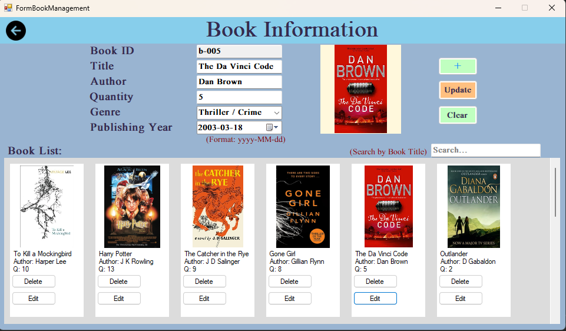
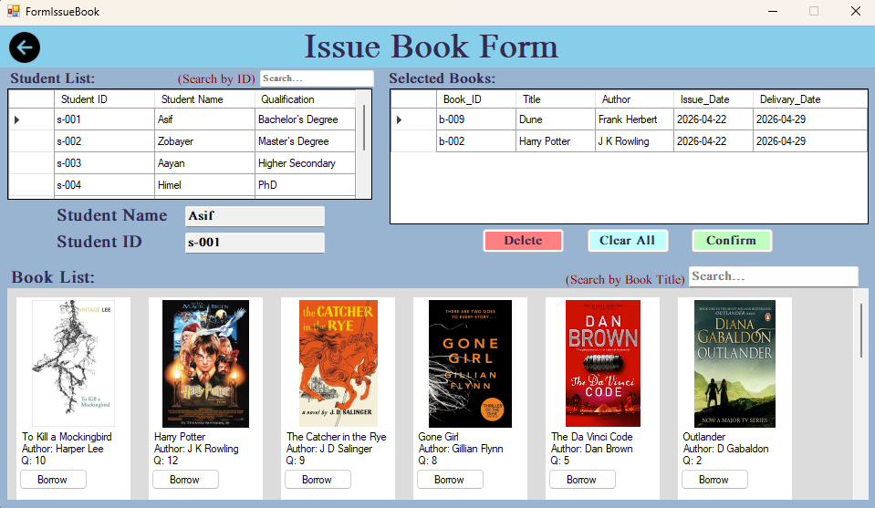
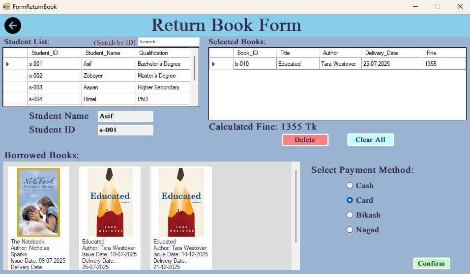
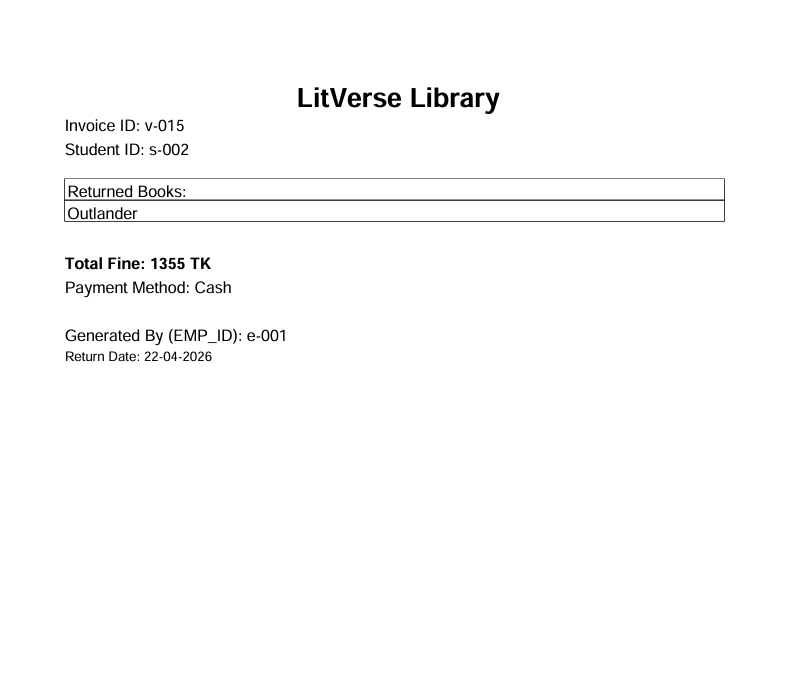
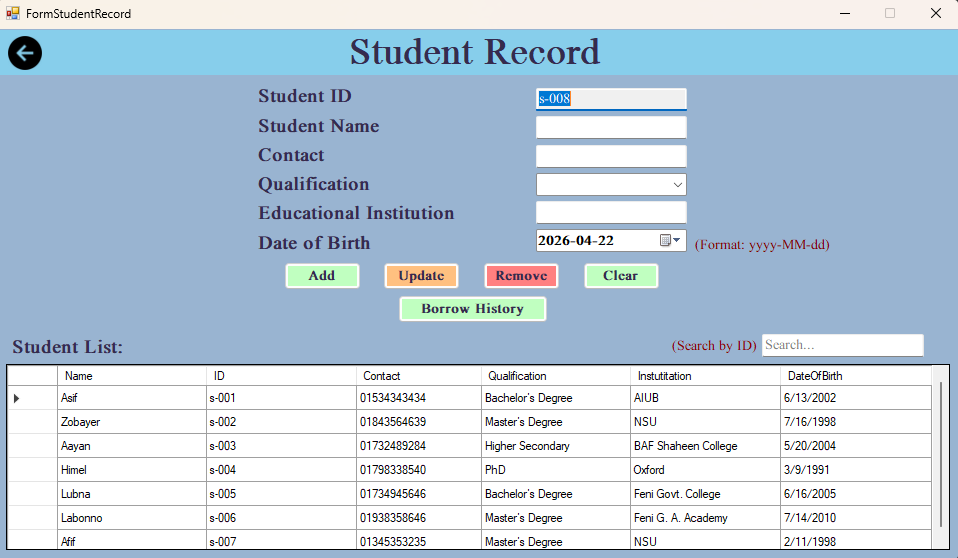
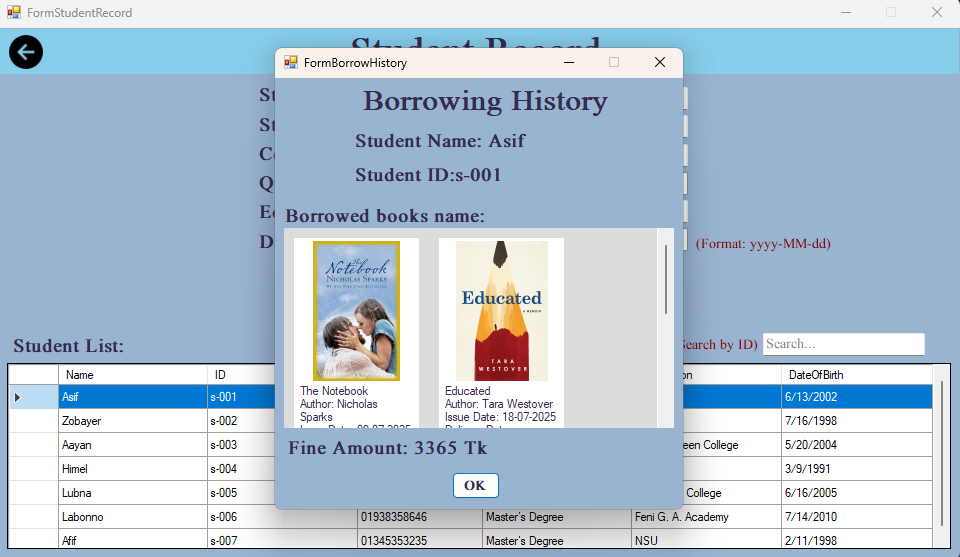

<div align="center">

# 📚 LitVerse — Library Management System

### A full-featured desktop application for managing library operations, built with C# Windows Forms and SQL Server.

[](https://www.microsoft.com/windows)
[](https://learn.microsoft.com/en-us/dotnet/csharp/)
[](https://www.microsoft.com/en-us/sql-server)
[](https://dotnet.microsoft.com/)

</div>

---

## 🎬 Demo Video

<div align="center">

[](https://www.youtube.com/watch?v=74ce6sgcSas&t=13s)

**▶ [Watch Full Demo on YouTube](https://www.youtube.com/watch?v=74ce6sgcSas&t=13s)**

</div>

---

## 📖 Project Description

**LitVerse** is a comprehensive **Library Management System** built using **C# Windows Forms** with a **Microsoft SQL Server** backend. It provides a complete digital solution for managing the day-to-day operations of a library — from book cataloging and student records to book issuance, returns, fine calculations, and PDF invoice generation.

The system supports **two user roles** — Admin and Employee — each with a dedicated dashboard and appropriate access levels. Designed with a clean, user-friendly UI, LitVerse streamlines library workflows and reduces manual effort.

---

## ✨ Features at a Glance

- 🔐 Role-based login (Admin & Employee)
- 📊 Real-time dashboard with statistics & genre chart
- 📚 Full book catalog management with cover images
- 👨‍🎓 Student record management (Add, Edit, Delete, Search)
- 👩‍💼 Employee management (Admin only)
- 📤 Book issuance with visual book selection
- 📥 Book return with automatic fine calculation
- 🧾 PDF invoice generation on return
- 📋 Per-student borrow history with book covers
- 🔍 Live search across all data grids

---

## 🖥️ Application Pages & Screenshots

---

### 🔑 Login Page
> Secure login screen for both Admin and Employee roles. Credentials are validated against the SQL Server database.



---

### 🛡️ Admin Dashboard
> The main control hub for Admins. Displays live statistics — Total Books, Issued Books, Available Books, Overdue Books, and Total Fine collected — along with a **Pie Chart** showing book distribution by genre.

**Accessible Modules:**
- Employee Management
- Book Management
- Student Records
- Issue Book
- Return Book



---

### 👷 Employee Dashboard
> A simplified dashboard for library employees with access to Student Records, Issue Book, and Return Book modules.



---

### 👩‍💼 Employee Info / Management
> Admin-exclusive panel to **Add, Update, Delete, and Search** employee records. Includes fields for name, contact, designation, and role assignment (Admin/Employee).



---

### 📚 Book Info / Management
> Manage the entire book catalog. Supports **Add, Update, Delete** with book cover image upload, genre tagging, quantity tracking, and ISBN management.



---

### 📤 Issue Book
> Visually issue books to students. Features a **live search** for students and a **visual book card layout** to browse and select books. Automatically updates stock quantity upon issuance and records the due date.



---

### 📥 Return Book
> Process book returns by selecting a student and their issued books. Automatically calculates **overdue fines** based on return date vs. due date. Displays a payment panel if fine is applicable.



---

### 🧾 PDF Invoice
> Generates a professional **PDF invoice** (using iTextSharp) upon successful book return. The invoice includes student info, book details, issue/return dates, and fine amount.



---

### 👨‍🎓 Student Record
> Manage student records with **Add, Update, Delete, and Search** functionality. Each student profile includes a photo, contact info, and enrollment details. Clicking a student opens their full **Borrow History**.



---

### 📋 Book Borrow History
> View a student's complete book borrowing history displayed as **visual book cards** with cover images, title, author, issue date, and due date. Also shows total fine accumulated.



---

## 🛠️ Tech Stack

| Component | Technology |
|---|---|
| Language | C# (.NET Framework) |
| UI Framework | Windows Forms (WinForms) |
| Database | Microsoft SQL Server |
| Data Access | ADO.NET (SqlConnection, SqlCommand, SqlDataAdapter) |
| PDF Generation | iTextSharp 5.5.13.4 |
| Cryptography | BouncyCastle 2.4.0 |
| Charts | MS Chart Controls (WinForms) |
| IDE | Visual Studio |

---

## 🚀 Getting Started

### Prerequisites
- Windows OS
- Visual Studio 2019 or later
- Microsoft SQL Server (local instance)
- .NET Framework 4.6.1+

### Installation

1. **Clone the repository**
   ```bash
   git clone https://github.com/hedayet-ullah-patwary/LitVerse-Library-CSharp.git
   ```

2. **Setup the Database**
   - Open SQL Server Management Studio (SSMS)
   - Create a database named `LibraryManagement`
   - Run the provided SQL scripts to create the required tables

3. **Configure Connection String**
   - Open `DataAccess.cs`
   - Update the connection string with your SQL Server credentials:
   ```csharp
   new SqlConnection(@"Data Source=YOUR_SERVER;Initial Catalog=LibraryManagement;
   User ID=your_user;Password=your_password");
   ```

4. **Build & Run**
   - Open `LibraryManagement.sln` in Visual Studio
   - Restore NuGet packages
   - Build the solution and run

### Or use the Installer
> A pre-built `.msi` installer is available at:
> `LibraryManagementSetup/Release/LibraryManagementSetup.msi`

---

## 🗃️ Database Tables

| Table | Description |
|---|---|
| `EMP_TABLE` | Employee/Admin records |
| `BOOK_TABLE` | Book catalog with images and quantity |
| `ISSUE_BOOK` | Active book issuance records |
| `INVOICE_TABLE` | Fine and return invoice records |

---

## 📁 Project Structure

```
LitVerse-Library-CSharp/
├── LibraryManagement/
│   ├── DataAccess.cs              # SQL Server data layer
│   ├── FormLogin.cs               # Login screen
│   ├── FormAdminDashboard.cs      # Admin dashboard + genre chart
│   ├── FormEmployeeDashboard.cs   # Employee dashboard
│   ├── FormBookManagement.cs      # Book CRUD
│   ├── FormEmployeeManagement.cs  # Employee CRUD (Admin only)
│   ├── FormStudentRecord.cs       # Student CRUD
│   ├── FormBorrowHistory.cs       # Per-student borrow history
│   ├── FormIssueBook.cs           # Book issuance
│   ├── FormReturnBook.cs          # Book return + fine + PDF
│   ├── Resources/                 # Images and assets
│   └── LibraryManagement.csproj
├── LibraryManagementSetup/
│   └── Release/
│       ├── LibraryManagementSetup.msi
│       └── setup.exe
└── LibraryManagement.sln
```

---

## 📦 NuGet Packages

- **iTextSharp 5.5.13.4** — PDF generation for return invoices
- **BouncyCastle.Cryptography 2.4.0** — Cryptographic support for iTextSharp

---

## 🤝 Contributing

Contributions are welcome! Feel free to open issues or submit pull requests.

---

## 📄 License

This project is open-source and available under the [MIT License](LICENSE).

---

<div align="center">

Made with ❤️ using C# & Windows Forms

</div>
